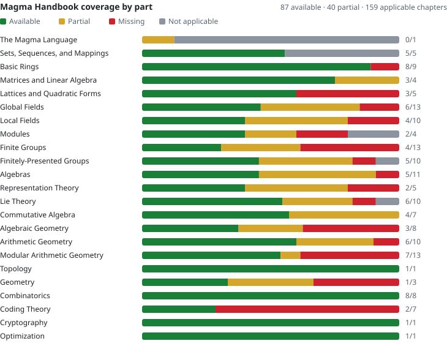

# Calyx

**An LLM-accelerated, free and open-source computer algebra system aiming for feature parity with Magma and beyond.**

<!-- magma-parity-badge:start -->[](parity/README.md)<!-- magma-parity-badge:end -->

Calyx began as a fork of [SageMath](https://www.sagemath.org/) and currently uses
its ecosystem as a foundation. The long-term goal is broader: to become an
independent computer algebra system for advanced research mathematics, with the
breadth of Magma, the openness of Sage, and a development cycle that can ship
major new capabilities much faster.

## Why Calyx exists

Calyx started from a practical problem: important computational mathematics I
needed was not available in suitable free software. The missing functionality
was often available in Magma, while the open-source alternatives were incomplete,
too specialized, or too slow for the computations I wanted to do.

The first response was to implement those missing pieces directly in SageMath.
That quickly exposed a second bottleneck: large, specialized mathematical
contributions can wait a long time for upstream review because the number of
people able and willing to review a particular research-level algorithm is
small. Upstream review remains valuable, and Calyx may still contribute selected
work back to Sage, but new functionality here does not depend on Sage's review
or release schedule before users can access it.

The result is Calyx: a fast-moving open computer algebra project whose goal is
to remove the practical reasons researchers still need proprietary mathematical
software.

## LLM-accelerated development

Calyx uses large language models aggressively as engineering force multipliers and welcomes AI generated contributions.

LLMs are used to:

- translate algorithms from papers into implementation plans;
- generate and refactor routine code;
- construct adversarial tests and regression cases;
- compare APIs and implementations across computer algebra systems;
- analyze profiles and identify performance bottlenecks;
- draft documentation and examples;
- review large diffs for likely correctness, performance, and maintainability
  issues.

The objective is to **massively compress implementation and shipping timelines**.

Code is expected to stand on normal mathematical and software evidence:

- exact or certified algorithms where required;
- explicit precision accounting for numerical and p-adic computations;
- mathematical references and clearly stated hypotheses;
- doctests, regression tests, and adversarial examples;
- comparison with independent implementations where possible;
- reproducible benchmarks;
- explicit failure when a result cannot be justified.


## Current work

### General Coleman integration and effective Chabauty

Calyx is developing a general Coleman integration stack for curves presented by
irreducible monic equations
`Q(x, y) = 0`, working on the smooth projective normalization rather than
being restricted to nonsingular affine or hyperelliptic models.

The implementation includes:

- finite and infinite integral bases;
- de Rham cohomology and Frobenius;
- ramified, bad, singular-model, and infinite residue disks;
- integration at general and tangential endpoints;
- arbitrary differential reduction;
- effective Chabauty--Coleman;
- torsion packets;
- certified p-adic precision and descent.

The aim is a practical open implementation of workflows that have historically
required proprietary software.

### Faster braid monodromy and fundamental groups

The `zariski_vankampen` implementation has been substantially optimized,
including:

- certified ball arithmetic in place of unnecessary exact `QQbar` work;
- cached polynomial restrictions and root data;
- lower-overhead parallel execution;
- deterministic and certified root/strand ordering;
- faster braid decomposition and GAP interaction.

On larger arrangements, the resulting speedups can exceed an order of magnitude.

Development branch: [`zvk-certified-numerics`](../../tree/zvk-certified-numerics)  
Upstream PR: [sagemath/sage#42844](https://github.com/sagemath/sage/pull/42844)

## Magma parity

<!-- magma-parity:start -->
Calyx tracks its coverage of Magma against the [Magma Handbook](https://magma.maths.usyd.edu.au/magma/handbook/) (V2.29), chapter by chapter. Of the 159 Handbook chapters that apply to Calyx, 87 are available and 40 partly available. The [full matrix](parity/README.md) lists every chapter with its status, where it lives in Calyx, and what is still missing.

<picture><source media="(prefers-color-scheme: dark)" srcset="parity/coverage-dark.svg"></picture>

<details>
<summary>Coverage by Handbook part</summary>

| Handbook part | Coverage | ✅ | 🟡 | ❌ | ➖ |
|---|---|--:|--:|--:|--:|
| The Magma Language | `█████░░░░░` 50% | · | 1 | · | 7 |
| Sets, Sequences, and Mappings | `██████████` 100% | 5 | · | · | 4 |
| Basic Rings | `█████████░` 89% | 8 | · | 1 | · |
| Matrices and Linear Algebra | `█████████░` 88% | 3 | 1 | · | · |
| Lattices and Quadratic Forms | `██████░░░░` 60% | 3 | · | 2 | · |
| Global Fields | `███████░░░` 65% | 6 | 5 | 2 | · |
| Local Fields | `██████░░░░` 60% | 4 | 4 | 2 | · |
| Modules | `██████░░░░` 62% | 2 | 1 | 1 | 1 |
| Finite Groups | `█████░░░░░` 46% | 4 | 4 | 5 | · |
| Finitely-Presented Groups | `███████░░░` 70% | 5 | 4 | 1 | 1 |
| Algebras | `███████░░░` 68% | 5 | 5 | 1 | · |
| Representation Theory | `██████░░░░` 60% | 2 | 2 | 1 | · |
| Lie Theory | `████████░░` 75% | 6 | 3 | 1 | 1 |
| Commutative Algebra | `████████░░` 79% | 4 | 3 | · | · |
| Algebraic Geometry | `█████░░░░░` 50% | 3 | 2 | 3 | · |
| Arithmetic Geometry | `████████░░` 75% | 6 | 3 | 1 | · |
| Modular Arithmetic Geometry | `██████░░░░` 58% | 7 | 1 | 5 | · |
| Topology | `██████████` 100% | 1 | · | · | · |
| Geometry | `█████░░░░░` 50% | 1 | 1 | 1 | · |
| Combinatorics | `██████████` 100% | 8 | · | · | · |
| Coding Theory | `███░░░░░░░` 29% | 2 | · | 5 | · |
| Cryptography | `██████████` 100% | 1 | · | · | · |
| Optimization | `██████████` 100% | 1 | · | · | · |
| **All 173 chapters** | `███████░░░` 67% | **87** | **40** | **32** | **14** |

✅ available · 🟡 partial · ❌ missing · ➖ not applicable. Coverage counts partial chapters as half.

</details>
<!-- magma-parity:end -->

## Request a Magma feature

If there is a Magma feature you need in free software, **[open an issue](https://github.com/aygerix/calyx-math/issues/new?template=magma-feature.yml)**.

Useful feature requests include a link to the relevant Magma Handbook section
and, if possible:

- the Magma intrinsic or subsystem you need;
- a small input example;
- the expected mathematical output;
- why the feature matters for your work;
- any papers describing the underlying algorithm;
- representative examples or benchmarks that would make good tests.

Large requests are absolutely welcome. A complete missing research workflow is often more
interesting than a small isolated method.

The long-term roadmap is simple: systematically close the important gaps between
free computer algebra software and Magma, while improving performance where an
existing open implementation is not yet competitive.

## Relationship to SageMath

Calyx currently inherits a large amount of infrastructure from SageMath and
periodically tracks upstream Sage development.

That is its origin, not its final scope. Calyx is developed as its own project,
with its own priorities and release cadence. The long-term goal is to become an
independent system capable of replacing SageMath and Magma for the advanced
computational workflows it supports.

For functionality inherited unchanged from SageMath, use the upstream
documentation:

- [SageMath](https://www.sagemath.org/)
- [Documentation](https://doc.sagemath.org/)
- [Installation guide](https://doc.sagemath.org/html/en/installation/)
- [Upstream repository](https://github.com/sagemath/sage)

This README intentionally focuses on what Calyx adds or changes.

## Installation

Calyx currently builds using SageMath's build system:

```bash
git clone --branch develop https://github.com/aygerix/calyx-math.git
cd calyx-math

make configure
./configure
make
./sage
```

Platform-specific prerequisites are documented in the upstream
[Sage installation guide](https://doc.sagemath.org/html/en/installation/).

## Status

Calyx is a research and development system under active construction.

Some branches contain mature, heavily tested implementations; others may contain
experimental algorithms or changing interfaces. For published computations,
pin the exact commit or release used.

Bug reports, mathematical counterexamples, difficult benchmark cases, feature
requests, and performance regressions are welcome.

## License

Calyx is derived from SageMath and remains distributed under the applicable
SageMath and bundled-software licenses. See [`COPYING.txt`](./COPYING.txt)
for details.

Calyx is an independent project and is not an official SageMath distribution.
